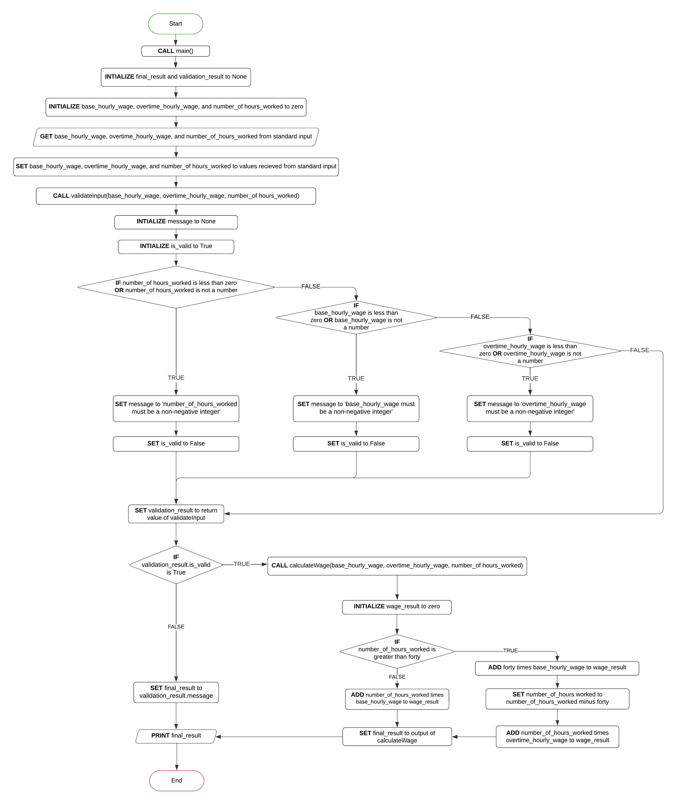

# Problem statement

A company wants a program that will calculate the weekly paycheck for an employee based on how many hours they worked. For this company, an employee earns $20 an hour for the first 40 hours that they work. The employee earns overtime, $30 an hour, for each hour they work above 40 hours.

Example: If an employee works 60 hours in a week, they would earn $20/hr for the first 40 hours. Then they would earn $30/hr for the 20 hours they worked overtime. Therefore, they earned: ($20/hr * 40hrs) + ($30/hr * 20 hrs) = $800 + $600 = $1400 total.

## Pseusdocode

```
function validateInput(number of hours worked, base hourly wage, overtime hourly wage):
    IF any of the inputs are invalid THEN
        RETURN FALSE and an error message indicating the invalid input
    ELSE
        RETURN TRUE and a message indicating success
    END IF


function calculateWage(number of hours worked, base hourly wage, overtime hourly wage):
    SET the wage result to 0
    IF the number of hours worked is greater than 40 THEN
        ADD 40 multiplied by the base hourly wage to wage result
        SET the number of hours worked to the number of hours worked minus 40
        ADD the number of hours worked times the overtime hourly wage to wage result
    ELSE
        ADD the number of hours worked times the base hourly wage to wage result
    END IF
    RETURN wage result


function main():
    SET the result to an empty string
    GET the number of hours worked by employee, base hourly wage, and overtime hourly wage from standard input
    CALL the validateInput function, passing in the number of hours worked, base hourly wage, and overtime hourly wage
    IF the validateInput function returns TRUE THEN
        CALL the calculateWage function, passing in the number of hours worked, base hourly wage, and overtime hourly wage
        SET the result to a string containing the employee's wages for the week
    ELSE
        SET the result to the error message recieved from the validateInput function
    END IF
    PRINT the result to standard output


CALL the main function
```

## Program Flowchart

